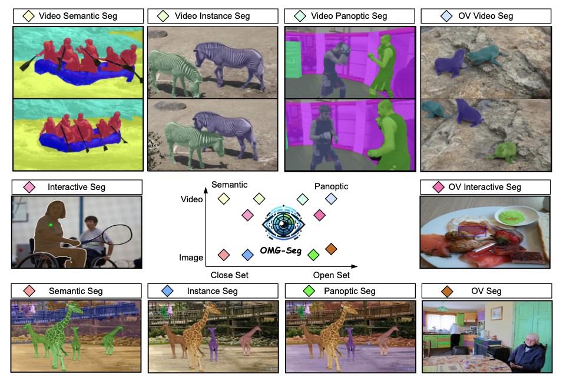

<br />
<p align="center">
  <h1 align="center">OMG-Seg: Is One Model Good Enough For All Segmentation?</h1>
  <p align="center">
    CVPR, 2024
    <br />
    <a href="https://lxtgh.github.io/"><strong>Xiangtai Li</strong></a>
    ·
    <a href="https://yuanhaobo.me/"><strong>Haobo Yuan</strong></a>
    .
    <a href="https://weivision.github.io/"><strong>Wei Li</strong></a>
    .
    <a href="https://henghuiding.github.io/"><strong>Henghui Ding</strong></a>
    ·
    <a href="https://wusize.github.io/"><strong>Size Wu</strong></a>
    ·
    <a href="https://zhangwenwei.cn/"><strong>Wenwei Zhang</strong></a>
    ·
    <br />
    <a href="https://scholar.google.com.hk/citations?user=y_cp1sUAAAAJ&hl=en"><strong>Yining Li</strong></a>
    .
    <a href="https://hellock.github.io/"><strong>Kai Chen</strong></a>
    .
    <a href="https://www.mmlab-ntu.com/person/ccloy/"><strong>Chen Change Loy*</strong></a>
  </p>

  <p align="center">
    S-Lab, MMlab@NTU, Shanghai AI Laboratory
  </p>

  <p align="center">
    <a href='https://arxiv.org/abs/2401.10229'>
       </a>
    <a href='https://lxtgh.github.io/project/omg_seg/' style='padding-left: 0.5rem;'>
       </a>
    <a href='https://huggingface.co/LXT/OMG_Seg' style='padding-left: 0.5rem;'>
       </a>
    <a href="https://huggingface.co/spaces/LXT/OMG_Seg">
     </a>
  </p>
<br />




### Short Introduction

In this work, we address various segmentation tasks, each traditionally tackled by distinct or partially unified models. We propose OMG-Seg, One Model that is Good enough to efficiently and effectively handle all the segmentation tasks, including image semantic, instance, and panoptic segmentation, as well as their video counterparts, open vocabulary settings, prompt-driven, interactive segmentation like SAM, and video object segmentation. To our knowledge, this is the first model to fill all these tasks in one model and achieve good enough performance.

We show that OMG-Seg, a transformer-based encoder-decoder architecture with task-specific queries and outputs, can support over ten distinct segmentation tasks and yet significantly reduce computational and parameter overhead across various tasks and datasets. We rigorously evaluate the inter-task influences and correlations during co-training. Both the code and models will be publicly available.

## News !!

- Test Models and Code are released!! 

## To-Do List

- Release training code. (to do)
- Release CKPTs.（done）
- Support HuggingFace. (done)

## Features

- The first universal model that support image segmentation, video segmentation, open-vocabulary segmentation, multi-dataset segmentation, interactive segmentation. 
- A new unified view for solving multiple segmentation tasks in one view. 

## Experiment Set Up


### Dataset 

See [DATASET.md](./DATASET.md)


### Install

Our codebase is built with [MMdetection-3.0](https://github.com/open-mmlab/mmdetection) tools.

See [INSTALL.md](./INSTALL.md)


### Quick Start

#### Preparation

1. First set up the [dataset](./DATASET.md) and [environment](./INSTALL.md).

2. Download pre-trained CLIP backbone. The scripts will 

3. Generate CLIP text embedding for each dataset. See the [embedding generation](EMB.md). 

#### Train

To be released and please stay tuned.

#### Test 

See the configs under seg/configs/m2ov_val.

Test Cityscape dataset, we observe 0.3% noises for Cityscapes panoptic segmentation

```commandline
./tools/dist.sh test seg/configs/m2ov_val/eval_m2_convl_300q_ov_cityscapes.py 4 --checkpoint model_path
```

Test COCO dataset, we observe 0.5% noises for COCO panoptic segmentation

```commandline
./tools/dist.sh test seg/configs/m2ov_val/eval_m2_convl_300q_ov_coco.py 4 --checkpoint model_path
```

Test Open-Vocabulary ADE dataset, we observe 0.8% noises for COCO panoptic segmentation

```commandline
./tools/dist.sh test seg/configs/m2ov_val/eval_m2_convl_300q_ov_ade.py 4 --checkpoint model_path
```

Test Interactive COCO segmentation:

```commandline
./tools/dist.sh test seg/configs/m2ov_val/eval_m2_convl_ov_coco_pan_point.py 4 --checkpoint model_path
```

Test Youtube-VIS-19 dataset

```commandline
./tools/dist.sh test seg/configs/m2ov_val/eval_m2_convl_300q_ov_y19.py 4 --checkpoint model_path
```

Test VIP-Seg dataset

```commandline
./tools/dist.sh test seg/configs/m2ov_val/eval_m2_convl_300q_ov_vipseg.py 1 --checkpoint model_path
```


### Trained Model

ConvNeXt-large backbone. [model](https://drive.google.com/file/d/12cERt0u6sY9A-OkQcSroyXfBmk9GHFLH/view?usp=drive_link)

ConvNeXt-XX-large backbone. [model](https://drive.google.com/file/d/1aDIDAq3u2j-FO-bttq-BYMelwhDFESIS/view?usp=sharing)

We will release more models in future.

## Citation

If you think OMG-Seg codebase are useful for your research, please consider referring us:

```bibtex
@article{li2024omg,
  title={OMG-Seg: Is One Model Good Enough For All Segmentation?},
  author={Li, Xiangtai and Yuan, Haobo and Li, Wei and Ding, Henghui and Wu, Size and Zhang, Wenwei and Li, Yining and Chen, Kai and Loy, Chen Change},
  journal={CVPR},
  year={2024}
}
```

## License

S-Lab [LICENSE](LICENSE).
