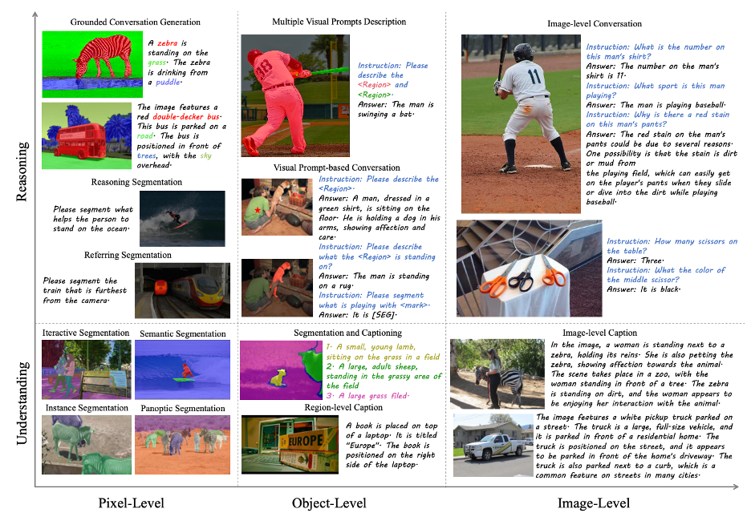

<br />
<p align="center">
  <h1 align="center">OMG-LLaVA: Bridging Image-level,
Object-level, Pixel-level Reasoning and Understanding</h1>
  <p align="center">
    NeurIPS, 2024
    <br />
    <a href="https://zhang-tao-whu.github.io/"><strong>Tao Zhang</strong></a>
    .
    <a href="https://lxtgh.github.io/"><strong>Xiangtai Li </strong></a>
    ·
    <a href="http://haofei.vip/"><strong>Hao Fei </strong></a>
    ·
    <a href="https://yuanhaobo.me/"><strong>Haobo Yuan</strong></a>
    .
    <a href="https://chocowu.github.io/"><strong>Shengqiong Wu</strong></a>
    ·
    <a href="https://scholar.google.com/citations?user=FjoRmF4AAAAJ&hl=en"><strong>Shunping Ji</strong></a>
    ·
    <a href="https://www.mmlab-ntu.com/person/ccloy/"><strong>Chen Change Loy</strong></a>
    .
    <a href="https://yanshuicheng.info/"><strong>Shuicheng Yan</strong></a>
    
  </p>
  
  <p align="center">
    Wuhan University,
    Skywork AI,
    S-Lab, MMlab@NTU,
    Bytedance
  </p>
  
   <p align="center">
    Xiangtai is the project leader and corresponding author.
  </p>
  
  <p align="center">
    <a href=''>
       </a>
    <a href='https://lxtgh.github.io/project/omg_llava/' style='padding-left: 0.5rem;'>
       </a>
    <a href='https://huggingface.co/zhangtao-whu/OMG-LLaVA/tree/main' style='padding-left: 0.5rem;'>
       </a>
    <a href="https://huggingface.co/spaces/zhangtao-whu/OMG-LLaVA">
     </a>
    <a href='https://73ebf9f4d6b8376505.gradio.live/' style='padding-left: 0.5rem;'>
       </a>
  </p>
<br />



## Prepare Environments, Data and Weights
Please refer to [INSTALL.md](./INSTALL.md)


## Setup Gradio Demo 

We provide scripts for building the Gradio demo. You can deploy OMG-LLaVA locally.

We suggest you use at least 32G GPU for 7B models.


```shell
python omg_llava/tools/app.py \
    ${PATH_TO_CONFIG} \
    ${PATH_TO_DeepSpeed_PTH}
    
# for example
python omg_llava/tools/app.py omg_llava/configs/finetune/omg_llava_7b_finetune_8gpus.py \
    ./pretrained/omg_llava/omg_llava_7b_finetune_8gpus.pth
    
```

## Training

  ```shell
  PYTHONPATH=. NPROC_PER_NODE=${GPUS_NUMBER} xtuner train \
      ${PATH_TO_CONFIG} \
      --deepspeed deepspeed_zero2
  
  # after train, please use the tools to convert deepspeed chekpoint to pth format
  PYTHONPATH=. python omg_llava/tools/convert_deepspeed2pth.py
      ${PATH_TO_CONFIG} \
      ${PATH_TO_DeepSpeed_PTH} \
      --save-path ./pretrained/omg_llava/${PTH_NAME.pth}
  
  # examples
  # OMG-LLaVA pretrain    
  PYTHONPATH=. NPROC_PER_NODE=8 xtuner train \
      omg_llava/configs/pretrain/omg_llava_7b_pretrain_8gpus.py \
      --deepspeed deepspeed_zero2
      
  # OMG-LLaVA finetune
  PYTHONPATH=. NPROC_PER_NODE=8 xtuner train \
      omg_llava/configs/finetune/omg_llava_7b_finetune_8gpus.py \
      --deepspeed deepspeed_zero2
      
  # finetune on specific tasks, such as RES and GCG
  PYTHONPATH=. NPROC_PER_NODE=8 xtuner train \
      omg_llava/configs/finetune/specific_tasks_finetune/finetune_refseg.py \
      --deepspeed deepspeed_zero2
  ```

## Chat and Evaluation
  
  ```shell
  # for chat
  python omg_llava/tools/chat_omg_llava.py \
    ${PATH_TO_CONFIG} \
    ${PATH_TO_PTH} \
    --image ${PATH_TO_IMAGE}
  # the corresponding segmentation masks will be saved at ./output.png
  
  # for evaluation referring expression segmentation
  NPROC_PER_NODE=8 xtuner refcoco_omg_seg_llava \
    ${PATH_TO_CONFIG} \
    ${PATH_TO_PTH} \
    --dataset ${refcoco or refcoco_plus or refcocog} \
    --split ${val or testA or testB}
  
  # for evaluation gcg
  NPROC_PER_NODE=8 xtuner gcg_omg_seg_llava \
    ${PATH_TO_CONFIG} \
    ${PATH_TO_PTH} \
    --output-name gcg_pred
  
  python omg_llava/tools/evaluate_gcg.py \
    --prediction_dir_path ./work_dirs/gcg_pred/
    --gt_dir_path ./data/glamm_data/annotations/gcg_val_test/
    --split ${val or test}
    
  # for evaluation region caption
  NPROC_PER_NODE=8 xtuner region_cap_mask_omg_seg_llava \
    ${PATH_TO_CONFIG} \
    ${PATH_TO_PTH} \
    --output-path ./work_dirs/region_cap_pred.json
    
  python omg_llava/tools/evaluate_region_cap.py \
    --results_dir ./work_dirs/region_cap_pred.json
  
  ```

